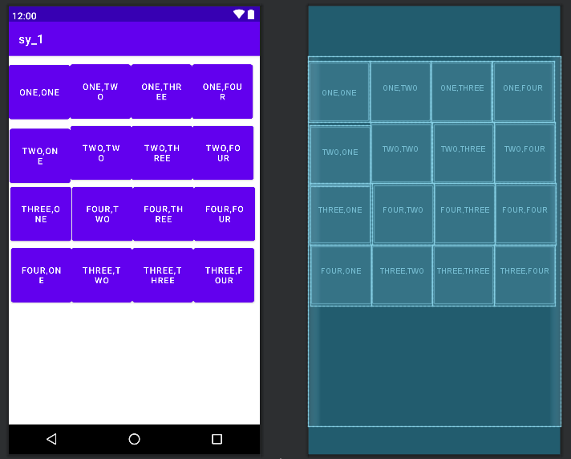
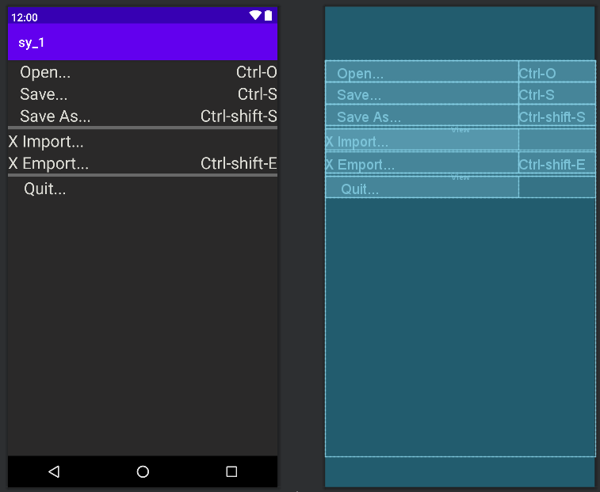

#实验二:Interfacelayout
##线性布局
利用线性布局实现：

在code中对Button的width、height、marginTop、marginLeft、text每一个属性进行设计实现。
代码：
```
layout.xml
<?xml version="1.0" encoding="utf-8"?>
<LinearLayout xmlns:android="http://schemas.android.com/apk/res/android"
    android:layout_width="match_parent"
    android:layout_height="match_parent">

    <Button
        android:id="@+id/button"
        android:layout_marginTop="9dp"
        android:layout_width="100dp"
        android:layout_height="100dp"
        android:text="@string/one_one" />

    <Button
        android:id="@+id/button1"
        android:layout_width="100dp"
        android:layout_height="100dp"
        android:layout_marginTop="0dp"
        android:text="@string/one_two" />

    <Button
        android:id="@+id/button2"
        android:layout_width="100dp"
        android:layout_height="100dp"
        android:text="@string/one_three"/>
    <Button
        android:id="@+id/button3"
        android:layout_width="100dp"
        android:layout_height="100dp"
        android:text="@string/one_four" />

    <Button
        android:id="@+id/button4"
        android:layout_width="100dp"
        android:layout_height="100dp"
        android:layout_marginLeft="-400dp"
        android:layout_marginTop="105dp"
        android:text="@string/two_one" />

    <Button
        android:id="@+id/button5"
        android:layout_width="100dp"
        android:layout_height="100dp"
        android:layout_marginTop="100dp"
        android:text="@string/two_two" />

    <Button
        android:id="@+id/button6"
        android:layout_width="100dp"
        android:layout_height="100dp"
        android:layout_marginTop="100dp"
        android:text="@string/two_three" />
    <Button
        android:id="@+id/button7"
        android:layout_width="100dp"
        android:layout_height="100dp"
        android:layout_marginTop="100dp"
        android:text="@string/two_four" />

    <Button
        android:id="@+id/button8"
        android:layout_width="100dp"
        android:layout_height="100dp"
        android:layout_marginLeft="-400dp"
        android:layout_marginTop="200dp"
        android:text="@string/three_one" />

    <Button
        android:id="@+id/button9"
        android:layout_width="100dp"
        android:layout_height="100dp"
        android:layout_marginTop="300dp"
        android:text="@string/three_two" />

    <Button
        android:id="@+id/button10"
        android:layout_width="100dp"
        android:layout_height="100dp"
        android:layout_marginTop="300dp"
        android:text="@string/three_three" />
    <Button
        android:id="@+id/button11"
        android:layout_width="100dp"
        android:layout_height="100dp"
        android:layout_marginTop="300dp"
        android:text="@string/three_four" />

    <Button
        android:id="@+id/button12"
        android:layout_width="100dp"
        android:layout_height="100dp"
        android:layout_marginLeft="-400dp"
        android:layout_marginTop="300dp"
        android:text="@string/four_one" />

    <Button
        android:id="@+id/button13"
        android:layout_width="100dp"
        android:layout_height="100dp"
        android:layout_marginTop="200dp"
        android:text="@string/four_two" />

    <Button
        android:id="@+id/button14"
        android:layout_width="100dp"
        android:layout_height="100dp"
        android:layout_marginTop="200dp"
        android:text="@string/four_three" />

    <Button
        android:id="@+id/button15"
        android:layout_width="100dp"
        android:layout_height="100dp"
        android:layout_marginTop="200dp"
        android:text="@string/four_four" />
</LinearLayout>

```
##表格布局
利用表格布局实现

在code中通过TableRow进行分行，利用stretchColumns对第0列进行拉伸，右侧TextView文字右对齐。
代码：
```
hellotablelayout.xml
<?xml version="1.0" encoding="utf-8"?>
<TableLayout xmlns:android="http://schemas.android.com/apk/res/android"
    android:layout_width="match_parent"
    android:layout_height="match_parent"
    android:background="@color/black1"
    android:stretchColumns="0">
    <TableRow>
        <TextView
            android:id="@+id/textView"
            android:layout_width="wrap_content"
            android:layout_height="wrap_content"
            android:text="   Open..."
            android:textColor="@color/grey"
            android:textSize="25dp" />
        <TextView
            android:id="@+id/textView1"
            android:layout_width="wrap_content"
            android:layout_height="wrap_content"
            android:text="Ctrl-O"
            android:textColor="@color/grey"
            android:gravity="right"
            android:textSize="25dp" />

    </TableRow>
    <TableRow>
        <TextView
            android:id="@+id/textView2"
            android:layout_width="wrap_content"
            android:layout_height="wrap_content"
            android:textColor="@color/grey"
            android:text="   Save..."
            android:textSize="25dp"
            />
        <TextView
            android:id="@+id/textView3"
            android:layout_width="wrap_content"
            android:layout_height="wrap_content"
            android:text="Ctrl-S"
            android:gravity="right"
            android:textColor="@color/grey"
            android:textSize="25dp" />
    </TableRow>
    <TableRow>
        <TextView
            android:id="@+id/textView4"
            android:layout_width="wrap_content"
            android:layout_height="wrap_content"
            android:textColor="@color/grey"
            android:text="   Save As..."
            android:textSize="25dp"
            />
        <TextView
            android:id="@+id/textView5"
            android:layout_width="wrap_content"
            android:layout_height="wrap_content"
            android:text="Ctrl-shift-S"
            android:gravity="right"
            android:textColor="@color/grey"
            android:textSize="25dp" />

    </TableRow>
    <View
        android:layout_height="5dip"
        android:background="#686868"
        android:layout_width="match_parent"/>
    <TableRow>
        <TextView
            android:id="@+id/textView6"
            android:layout_width="wrap_content"
            android:layout_height="wrap_content"
            android:text="X Import..."
            android:textColor="@color/grey"
            android:textSize="25dp" />
    </TableRow>
    <TableRow>
        <TextView
            android:id="@+id/textView7"
            android:layout_width="wrap_content"
            android:layout_height="wrap_content"
            android:text="X Emport..."
            android:textColor="@color/grey"
            android:textSize="25dp" />
        <TextView
            android:id="@+id/textView8"
            android:layout_width="wrap_content"
            android:layout_height="wrap_content"
            android:text="Ctrl-shift-E"
            android:gravity="right"
            android:textColor="@color/grey"
            android:textSize="25dp" />
    </TableRow>
    <View
        android:layout_height="5dip"
        android:background="#686868"
        android:layout_width="match_parent"/>

    <TableRow>
        <TextView
            android:id="@+id/textView9"
            android:layout_width="wrap_content"
            android:layout_height="wrap_content"
            android:text="    Quit..."
            android:textColor="@color/grey"
            android:textSize="25dp" />
    </TableRow>

</TableLayout>
```
##约束布局1
利用ConstraintLayout实现

在design中对各个组件的位置进行布局，code中对其text、backgroundTint进行修改。
```
constraint.xml
<?xml version="1.0" encoding="utf-8"?>
<androidx.constraintlayout.widget.ConstraintLayout xmlns:android="http://schemas.android.com/apk/res/android"
    xmlns:app="http://schemas.android.com/apk/res-auto"
    xmlns:tools="http://schemas.android.com/tools"
    android:layout_width="match_parent"
    android:layout_height="match_parent">

    <Button
        android:id="@+id/button60"
        android:layout_width="63dp"
        android:layout_height="48dp"
        android:layout_marginStart="320dp"
        android:layout_marginTop="424dp"
        android:text="-"
        android:textColor="@color/black"
        android:backgroundTint="@color/buttoncolor"
        app:layout_constraintStart_toStartOf="parent"
        app:layout_constraintTop_toTopOf="parent" />

    <Button
        android:id="@+id/button58"
        android:layout_width="63dp"
        android:layout_height="48dp"
        android:layout_marginStart="116dp"
        android:layout_marginTop="420dp"
        android:text="0"
        android:textColor="@color/black"
        android:backgroundTint="@color/buttoncolor"
        app:layout_constraintStart_toStartOf="parent"
        app:layout_constraintTop_toTopOf="parent" />

    <Button
        android:id="@+id/button59"
        android:layout_width="63dp"
        android:layout_height="48dp"
        android:layout_marginStart="216dp"
        android:layout_marginTop="420dp"
        android:text="="
        android:textColor="@color/black"
        android:backgroundTint="@color/buttoncolor"
        app:layout_constraintStart_toStartOf="parent"
        app:layout_constraintTop_toTopOf="parent" />

    <Button
        android:id="@+id/button57"
        android:layout_width="63dp"
        android:layout_height="48dp"
        android:layout_marginStart="16dp"
        android:layout_marginTop="416dp"
        android:text="."
        android:textColor="@color/black"
        android:backgroundTint="@color/buttoncolor"
        app:layout_constraintStart_toStartOf="parent"
        app:layout_constraintTop_toTopOf="parent" />

    <Button
        android:id="@+id/button54"
        android:layout_width="63dp"
        android:layout_height="48dp"
        android:layout_marginStart="116dp"
        android:layout_marginTop="332dp"
        android:text="2"
        android:textColor="@color/black"
        android:backgroundTint="@color/buttoncolor"
        app:layout_constraintStart_toStartOf="parent"
        app:layout_constraintTop_toTopOf="parent" />

    <Button
        android:id="@+id/button55"
        android:layout_width="63dp"
        android:layout_height="48dp"
        android:layout_marginStart="216dp"
        android:layout_marginTop="332dp"
        android:text="3"
        android:textColor="@color/black"
        android:backgroundTint="@color/buttoncolor"
        app:layout_constraintStart_toStartOf="parent"
        app:layout_constraintTop_toTopOf="parent" />

    <Button
        android:id="@+id/button56"
        android:layout_width="63dp"
        android:layout_height="48dp"
        android:layout_marginStart="320dp"
        android:layout_marginTop="332dp"
        android:text="+"
        android:textColor="@color/black"
        android:backgroundTint="@color/buttoncolor"
        app:layout_constraintStart_toStartOf="parent"
        app:layout_constraintTop_toTopOf="parent" />

    <Button
        android:id="@+id/button49"
        android:layout_width="63dp"
        android:layout_height="48dp"
        android:layout_marginStart="16dp"
        android:layout_marginTop="244dp"
        android:text="4"
        android:textColor="@color/black"
        android:backgroundTint="@color/buttoncolor"
        app:layout_constraintStart_toStartOf="parent"
        app:layout_constraintTop_toTopOf="parent" />

    <Button
        android:id="@+id/button50"
        android:layout_width="63dp"
        android:layout_height="48dp"
        android:layout_marginStart="116dp"
        android:layout_marginTop="244dp"
        android:text="5"
        android:textColor="@color/black"
        android:backgroundTint="@color/buttoncolor"
        app:layout_constraintStart_toStartOf="parent"
        app:layout_constraintTop_toTopOf="parent" />

    <Button
        android:id="@+id/button51"
        android:layout_width="63dp"
        android:layout_height="48dp"
        android:layout_marginStart="216dp"
        android:layout_marginTop="244dp"
        android:text="6"
        android:textColor="@color/black"
        android:backgroundTint="@color/buttoncolor"
        app:layout_constraintStart_toStartOf="parent"
        app:layout_constraintTop_toTopOf="parent" />

    <Button
        android:id="@+id/button52"
        android:layout_width="63dp"
        android:layout_height="48dp"
        android:layout_marginStart="320dp"
        android:layout_marginTop="244dp"
        android:text="×"
        android:textColor="@color/black"
        android:backgroundTint="@color/buttoncolor"
        app:layout_constraintStart_toStartOf="parent"
        app:layout_constraintTop_toTopOf="parent" />

    <Button
        android:id="@+id/button53"
        android:layout_width="63dp"
        android:layout_height="48dp"
        android:layout_marginStart="16dp"
        android:layout_marginTop="332dp"
        android:text="1"
        android:textColor="@color/black"
        android:backgroundTint="@color/buttoncolor"
        app:layout_constraintStart_toStartOf="parent"
        app:layout_constraintTop_toTopOf="parent" />

    <Button
        android:id="@+id/button47"
        android:layout_width="63dp"
        android:layout_height="48dp"
        android:layout_marginStart="16dp"
        android:layout_marginTop="164dp"
        android:text="7"
        android:textColor="@color/black"
        android:backgroundTint="@color/buttoncolor"
        app:layout_constraintStart_toStartOf="parent"
        app:layout_constraintTop_toTopOf="parent" />

    <Button
        android:id="@+id/button48"
        android:layout_width="63dp"
        android:layout_height="48dp"
        android:layout_marginStart="320dp"
        android:layout_marginTop="164dp"
        android:text="÷"
        android:textColor="@color/black"
        android:backgroundTint="@color/buttoncolor"
        app:layout_constraintStart_toStartOf="parent"
        app:layout_constraintTop_toTopOf="parent" />

    <Button
        android:id="@+id/button45"
        android:layout_width="63dp"
        android:layout_height="48dp"
        android:layout_marginStart="116dp"
        android:layout_marginTop="164dp"
        android:text="8"
        android:textColor="@color/black"
        android:backgroundTint="@color/buttoncolor"
        app:layout_constraintStart_toStartOf="parent"
        app:layout_constraintTop_toTopOf="parent" />

    <Button
        android:id="@+id/button46"
        android:layout_width="63dp"
        android:layout_height="48dp"
        android:layout_marginStart="216dp"
        android:layout_marginTop="164dp"
        android:text="9"
        android:textColor="@color/black"
        android:backgroundTint="@color/buttoncolor"
        app:layout_constraintStart_toStartOf="parent"
        app:layout_constraintTop_toTopOf="parent" />

    <TextView
        android:id="@+id/textView2"
        android:layout_width="108dp"
        android:layout_height="0dp"
        android:layout_marginStart="8dp"
        android:layout_marginTop="16dp"
        android:text="Input"
        android:textSize="30dp"
        app:layout_constraintStart_toStartOf="parent"
        app:layout_constraintTop_toTopOf="parent" />

    <TextView
        android:id="@+id/textView"
        android:layout_width="371dp"
        android:layout_height="50dp"
        android:layout_marginStart="8dp"
        android:layout_marginTop="68dp"
        android:layout_marginEnd="8dp"
        android:background="@color/teal_700"
        android:textSize="40dp"
        android:text="0.0"
        android:textAlignment="textEnd"
        app:layout_constraintEnd_toEndOf="parent"
        app:layout_constraintHorizontal_bias="0.216"
        app:layout_constraintStart_toStartOf="parent"
        app:layout_constraintTop_toTopOf="parent" />


</androidx.constraintlayout.widget.ConstraintLayout>
```
##约束布局2
利用ConstraintLayout实现

在design中对ImageView、TextView、Button进行布局。
```
constraintlayout2.xml
<?xml version="1.0" encoding="utf-8"?>
<androidx.constraintlayout.widget.ConstraintLayout xmlns:android="http://schemas.android.com/apk/res/android"
    xmlns:app="http://schemas.android.com/apk/res-auto"
    xmlns:tools="http://schemas.android.com/tools"
    android:id="@+id/linearLayout1"
    android:layout_width="match_parent"
    android:layout_height="match_parent">

    <androidx.constraintlayout.widget.ConstraintLayout
        android:id="@+id/linearLayout"
        android:layout_width="match_parent"
        android:layout_height="match_parent"
        tools:layout_editor_absoluteX="16dp"
        tools:layout_editor_absoluteY="-16dp">

        <ImageView
            android:id="@+id/imageView7"
            android:layout_width="45dp"
            android:layout_height="52dp"
            android:layout_marginStart="52dp"
            android:layout_marginTop="16dp"
            app:layout_constraintStart_toStartOf="parent"
            app:layout_constraintTop_toTopOf="parent"
            android:contentDescription="space_station_icon"
            app:srcCompat="@drawable/space_station_icon" />

        <ImageView
            android:id="@+id/imageView8"
            android:layout_width="67dp"
            android:layout_height="60dp"
            android:layout_marginStart="168dp"
            android:layout_marginTop="16dp"
            app:layout_constraintStart_toStartOf="parent"
            app:layout_constraintTop_toTopOf="parent"
            app:srcCompat="@drawable/rocket_icon" />

        <ImageView
            android:id="@+id/imageView9"
            android:layout_width="47dp"
            android:layout_height="54dp"
            android:layout_marginEnd="52dp"
            android:layout_marginBottom="532dp"
            app:layout_constraintBottom_toBottomOf="parent"
            app:layout_constraintEnd_toEndOf="parent"
            app:srcCompat="@drawable/rover_icon" />

        <TextView
            android:id="@+id/textView6"
            android:layout_width="100dp"
            android:layout_height="29dp"
            android:layout_marginStart="28dp"
            android:layout_marginBottom="504dp"
            android:text="Space Stations"
            app:layout_constraintBottom_toBottomOf="parent"
            app:layout_constraintStart_toStartOf="parent" />


        <TextView
            android:id="@+id/textView7"
            android:layout_width="wrap_content"
            android:layout_height="wrap_content"
            android:layout_marginStart="180dp"
            android:layout_marginTop="76dp"
            android:text="Flights"
            app:layout_constraintStart_toStartOf="parent"
            app:layout_constraintTop_toTopOf="parent" />

        <TextView
            android:id="@+id/textView8"
            android:layout_width="wrap_content"
            android:layout_height="wrap_content"
            android:layout_marginStart="316dp"
            android:layout_marginBottom="508dp"
            android:text="Rovers"
            app:layout_constraintBottom_toBottomOf="parent"
            app:layout_constraintStart_toStartOf="parent" />

        <ImageView
            android:id="@+id/imageView10"
            android:layout_width="wrap_content"
            android:layout_height="wrap_content"
            android:layout_marginEnd="148dp"
            android:layout_marginBottom="148dp"
            app:layout_constraintBottom_toBottomOf="parent"
            app:layout_constraintEnd_toEndOf="parent"
            app:layout_constraintHorizontal_bias="0.884"
            app:layout_constraintStart_toEndOf="@+id/imageView13"
            app:layout_constraintTop_toBottomOf="@+id/imageView12"
            app:layout_constraintVertical_bias="1.0"
            app:srcCompat="@drawable/galaxy" />

        <TextView
            android:id="@+id/textView10"
            android:layout_width="411dp"
            android:layout_height="113dp"

            android:layout_marginTop="120dp"
            android:layout_marginBottom="14dp"
            app:layout_constraintBottom_toTopOf="@+id/switch1"
            app:layout_constraintEnd_toEndOf="parent"
            app:layout_constraintHorizontal_bias="1.0"
            app:layout_constraintStart_toStartOf="parent"
            app:layout_constraintTop_toTopOf="parent"
            app:layout_constraintVertical_bias="0.0" />

        <TextView
            android:id="@+id/textView11"
            android:layout_width="125dp"
            android:layout_height="109dp"
            android:layout_marginStart="68dp"
            android:layout_marginBottom="372dp"
            android:background="@color/teal_700"
            android:gravity="center"
            android:text="DCA"
            android:textColor="@color/white"
            android:textSize="20dp"
            app:layout_constraintBottom_toBottomOf="parent"
            app:layout_constraintStart_toStartOf="parent" />

        <TextView
            android:id="@+id/textView12"
            android:layout_width="125dp"
            android:layout_height="109dp"
            android:layout_marginStart="220dp"
            android:layout_marginBottom="372dp"
            android:background="@color/teal_700"
            android:gravity="center"
            android:text="MARS"
            android:textAlignment="center"
            android:textColor="@color/white"
            android:textSize="20dp"
            app:layout_constraintBottom_toBottomOf="parent"
            app:layout_constraintStart_toStartOf="parent" />

        <ImageView
            android:id="@+id/imageView12"
            android:layout_width="77dp"
            android:layout_height="87dp"
            android:layout_marginStart="102dp"
            android:layout_marginEnd="108dp"
            android:layout_marginBottom="384dp"
            app:layout_constraintBottom_toBottomOf="parent"
            app:layout_constraintEnd_toEndOf="@+id/textView12"
            app:layout_constraintHorizontal_bias="0.0"
            app:layout_constraintStart_toStartOf="@+id/textView11"
            app:srcCompat="@drawable/double_arrows" />

        <ImageView
            android:id="@+id/imageView13"
            android:layout_width="29dp"
            android:layout_height="46dp"
            android:layout_marginStart="116dp"
            android:layout_marginTop="156dp"
            app:layout_constraintStart_toStartOf="parent"
            app:layout_constraintTop_toBottomOf="@+id/textView11"
            app:srcCompat="@drawable/rocket_icon" />

        <Button
            android:id="@+id/button22"
            android:layout_width="406dp"
            android:layout_height="48dp"
            android:layout_marginStart="6dp"
            android:layout_marginEnd="6dp"
            android:backgroundTint="@color/teal_700"
            android:text="DEPART"
            app:layout_constraintBottom_toBottomOf="parent"
            app:layout_constraintEnd_toEndOf="parent"
            app:layout_constraintHorizontal_bias="0.571"
            app:layout_constraintStart_toStartOf="parent"
            app:layout_constraintTop_toBottomOf="@+id/imageView10"
            app:layout_constraintVertical_bias="1.0" />

        <TextView
            android:id="@+id/textView13"
            android:layout_width="168dp"
            android:layout_height="38dp"
            android:layout_marginStart="28dp"
            android:layout_marginBottom="320dp"
            android:background="@color/orange"
            android:gravity="center|left"
            android:text="One Way"
            android:textColor="@color/white"
            android:textSize="20dp"
            app:layout_constraintBottom_toBottomOf="parent"
            app:layout_constraintStart_toStartOf="parent" />

        <TextView
            android:id="@+id/textView14"
            android:layout_width="108dp"
            android:layout_height="36dp"
            android:layout_marginStart="28dp"
            android:layout_marginBottom="272dp"
            android:background="@color/orange"
            android:gravity="center|left"
            android:text="1 Traveller"
            android:textColor="@color/white"
            android:textSize="20dp"
            app:layout_constraintBottom_toBottomOf="parent"
            app:layout_constraintStart_toStartOf="parent" />

        <Switch
            android:id="@+id/switch1"
            android:layout_width="65dp"
            android:layout_height="48dp"
            android:layout_marginBottom="315dp"
            app:layout_constraintBottom_toBottomOf="parent"
            app:layout_constraintEnd_toEndOf="@+id/textView13" />


    </androidx.constraintlayout.widget.ConstraintLayout>

</androidx.constraintlayout.widget.ConstraintLayout>

```