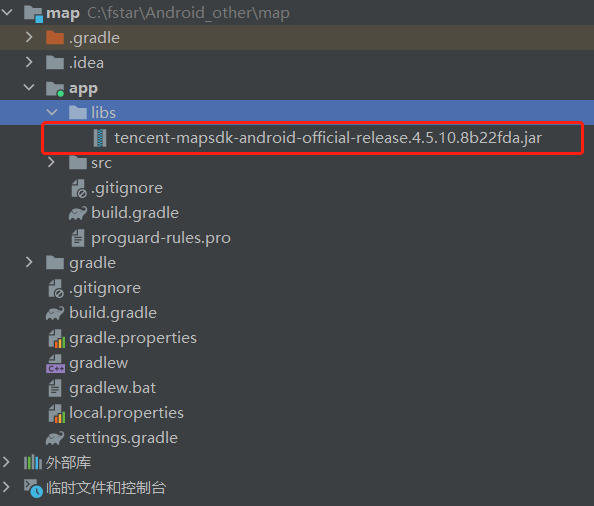

## 1.概述

#### 1.1腾讯位置服务地图SDK

    腾讯位置服务地图SDK（Android）是一套基于Android 4.3及以上版本的多种地理位置服务的应用程序接口。 通过调用该接口，您可以轻松访问腾讯地图服务和数据，构建功能丰富、交互性强、契合各种行业场景的地图类应用程序。也可以在自己的Android应用中加入地图相关的功能，包括：地图展示、标注、绘制图形等。
    

#### 1.2兼容性

    支持Android 4.3及以上系统。

## 2.创建工程

腾讯位置服务链接:<https://lbs.qq.com/>

#### 2.1 获取Appkey


#### 2.2 配置AppKey

在AndroidManifest.xml的application标签中配置key

``` 
    <application>
        ...
        <meta-data android:name="TencentMapSDK" android:value="您申请的Key" />
    </application>
```

#### 2.3 配置工程

**方法1：主动添加SDK**

1. 将jar放在libs目录下



2. 右键该jar包，选择Add AS Library,弹出窗口选择确定


   
3. 变成下图所示为导入成功


4. 将jni目录下的所有文件按照原目录格式，拷贝到AndroidStudio项目对应的 app/src/main/jniLibs/ 目录下:


**方法2：Gradle配置maven或jcenter仓库集成SDK**

1. 在 Project 的 build.gradle 文件中配置 repositories，添加 maven 或 jcenter仓库地址。AndroidStudio 默认会在 Project 的 build.gradle 为所有module自动添加 jcenter 仓库地址，如果已存在，则不需要重复添加:

```

buildscript {
    repositories {
        google()
        jcenter()
        mavenCentral()
    }
    dependencies {
        classpath 'com.android.tools.build:gradle:版本'
    }
}
//向所有模块配置仓库：
allprojects {
    repositories {
        google()
        jcenter()
        mavenCentral()
    }
}

```

2. 在 build.gradle 文件的 dependencies 中增加配置

```

implementation fileTree(dir: 'libs', include: ['*.jar'])
implementation 'com.tencent.map:tencent-map-vector-sdk:版本号'

```

#### 2.4 代码混淆

如果需要混淆工程，在module里找到proguard-rules.pro文件，添加如下混淆脚本：

```

-keep public class com.tencent.lbssearch.** {*;}
-keep public class com.tencent.map.** {*;}
-keep public class com.tencent.mapsdk.** {*;}
-keep public class com.tencent.tencentmap.**{*;}
-keep public class com.tencent.tmsbeacon.**{*;}
-keep public class com.tencent.tmsbeacon.**{*;}
-dontwarn com.qq.**
-dontwarn com.tencent.**

```

#### 2.5 权限配置

地图SDK需要使用网络，访问硬件存储等系统权限，在AndroidManifest.xml文件里，添加如下权限：

请在manifest文件下配置如下权限：

```

<!--腾讯地图 SDK 要求的权限(开始)-->
<!--访问网络获取地图服务-->
<uses-permission android:name="android.permission.INTERNET"/>
<!--检查网络可用性-->
<uses-permission android:name="android.permission.ACCESS_NETWORK_STATE"/>
<!-- 访问WiFi状态 -->
<uses-permission android:name="android.permission.ACCESS_WIFI_STATE" />
<!--需要外部存储写权限用于保存地图缓存-->
<uses-permission android:name="android.permission.WRITE_EXTERNAL_STORAGE"/>
<!--获取 device id 辨别设备-->
<uses-permission android:name="android.permission.READ_PHONE_STATE"/>
<!--腾讯地图 SDK 要求的权限(结束)-->

```


## 3. 地图

#### 3.1 基础地图
   
   地图视图：

>- MApView:普通地图视图
>- TextureMapView:纹理化地图视图
>- MapRenderLayer:地图渲染层容器

差异：

|  视图类型  |  内部实现  |  视图动画  |  性能  |  ListView显示  |  多实例  |
| :----: | :----: | :----: | :----: | :----: | :----: |
| MapView |  GLSurfaceView  |  不支持  |  高  |  不流畅  |  支持  |
| TextureMapView |  TextureView  |  支持  |  中  |  不流畅  |  支持  |
| MapRenderLayer |  Surface+GLThread  |  外部控制  |  外部控制  |  流畅  |  支持  |

绑定地图生命周期：创建地图视图后，需要绑定应用生命周期，以保障地图在应用的不同生命周期中能正确处理显示和刷新逻辑。

|  应用生命周期  |  地图生命周期  |
| :----: | :----: |
| onStart() | onStart() |
| onResume() | onResume() |
| onPause() | onPause() |
| onStop() | onStop() |
| onDestory() | onDestory() |

1. 基础地图布局
   
```
<?xml version="1.0" encoding="utf-8"?>
<androidx.constraintlayout.widget.ConstraintLayout xmlns:android="http://schemas.android.com/apk/res/android"
    xmlns:app="http://schemas.android.com/apk/res-auto"
    xmlns:tools="http://schemas.android.com/tools"
    android:layout_width="match_parent"
    android:layout_height="match_parent"
    tools:context=".BaseMapActivity">

    <!--基础地图-->
    <com.tencent.tencentmap.mapsdk.maps.TextureMapView
        android:id="@+id/mapView"
        android:layout_width="match_parent"
        android:layout_height="match_parent"/>

</androidx.constraintlayout.widget.ConstraintLayout>

``` 

2. 创建基础地图的activity
   
```
public class BaseMapActivity extends AppCompatActivity {
    private TextureMapView mapView;
    private TencentMap tencentMap;

    @Override
    protected void onCreate(Bundle savedInstanceState) {
        super.onCreate(savedInstanceState);
        setContentView(R.layout.activity_base_map);

        TencentMapInitializer.setAgreePrivacy(true);

        mapView = findViewById(R.id.mapView);

        tencentMap = mapView.getMap();
    }

    /**
     * mapview的生命周期管理
     */
    @Override
    protected void onStart() {
        super.onStart();
        mapView.onStart();
    }

    @Override
    protected void onResume() {
        super.onResume();
        mapView.onResume();
    }

    @Override
    protected void onPause() {
        super.onPause();
        mapView.onPause();
    }

    @Override
    protected void onStop() {
        super.onStop();
        mapView.onStop();
    }

    @Override
    protected void onDestroy() {
        super.onDestroy();
        mapView.onDestroy();
    }

    @Override
    protected void onRestart() {
        super.onRestart();
        mapView.onRestart();
    }

}
```
 
 效果图：

 

 #### 3.2 地图类型

 三种类型：
 | 类 | 常量 | 说明 |
 | :----: | :----: | :----: |
 | TecentMap | MAP_TYPE_NORMAL | 普通地图(默认) |
 | TecentMap | MAP_TYPE_SATELLITE | 卫星地图 |
 | TecentMap | MAP_TYPE_DARK | 暗色地图 |
 | TecentMap | MAP_TYPE_NIGHT | 夜景地图 |
 | TecentMap | MAP_TYPE_NAVI | 导航地图 |

实时路况：
腾讯地图SDK还提供了实时路况图层，可以为提供实时交通数据的城市展示实时交通状况。

```
//开启路况服务
tencentMap.setTrafficEnabled(true);
```

1. 地图类型布局
   
```
<?xml version="1.0" encoding="utf-8"?>
<RelativeLayout xmlns:android="http://schemas.android.com/apk/res/android"
    xmlns:app="http://schemas.android.com/apk/res-auto"
    xmlns:tools="http://schemas.android.com/tools"
    android:layout_width="match_parent"
    android:layout_height="match_parent"
    tools:context=".MapTypeActivity">
    <RadioGroup
        android:id="@+id/map_type"
        android:layout_width="match_parent"
        android:layout_height="wrap_content"
        android:orientation="horizontal">
        <RadioButton
            android:id="@+id/normal"
            android:layout_width="wrap_content"
            android:layout_height="wrap_content"
            android:checked="true"
            android:text="普通图">
        </RadioButton>
        <RadioButton
            android:id="@+id/satellite"
            android:layout_width="wrap_content"
            android:layout_height="wrap_content"
            android:text="卫星图">
        </RadioButton>
        <RadioButton
            android:id="@+id/dark"
            android:layout_width="wrap_content"
            android:layout_height="wrap_content"
            android:text="暗色图">
        </RadioButton>
        <RadioButton
            android:id="@+id/traffic"
            android:layout_width="wrap_content"
            android:layout_height="wrap_content"

            android:text="路况">
        </RadioButton>     
    </RadioGroup>

    <com.tencent.tencentmap.mapsdk.maps.MapView
        android:layout_below="@+id/map_type"
        android:id="@+id/basemap"
        android:layout_width="match_parent"
        android:layout_height="match_parent">

    </com.tencent.tencentmap.mapsdk.maps.MapView>
</RelativeLayout>

```

1. 地图类型Activity

```
public class MapTypeActivity extends AppCompatActivity implements RadioGroup.OnCheckedChangeListener {

    private MapView mapView;
    private TencentMap tencentMap;
    private RadioGroup radioGroup;
    private MapLifecycle mapLifecycle;
    @Override
    protected void onCreate(Bundle savedInstanceState) {
        super.onCreate(savedInstanceState);
        setContentView(R.layout.activity_map_type);
        TencentMapInitializer.setAgreePrivacy(true);
        mapView=findViewById(R.id.basemap);
        radioGroup=findViewById(R.id.map_type);
        radioGroup.setOnCheckedChangeListener(this);
        tencentMap=mapView.getMap();
        mapLifecycle=new MapLifecycle(mapView);
        getLifecycle().addObserver(mapLifecycle);
    }

    @Override
    public void onCheckedChanged(RadioGroup radioGroup, int i) {
        switch (i){
//            普通地图
            case R.id.normal:
                tencentMap.setTrafficEnabled(false);
                tencentMap.setMapType(TencentMap.MAP_TYPE_NORMAL);
                break;
//            卫星地图
            case R.id.satellite:
                tencentMap.setTrafficEnabled(false);
                tencentMap.setMapType(TencentMap.MAP_TYPE_SATELLITE);
                break;
//            暗色地图
            case R.id.dark:
                tencentMap.setTrafficEnabled(false);
                tencentMap.setMapType(TencentMap.MAP_TYPE_DARK);
                break;
//            路况地图
            case R.id.traffic:
                tencentMap.setTrafficEnabled(true);
                break;
            default:
                break;

        }
    }
}

```

效果图：


 #### 3.3 个性化地图
 
1. 在个性化地图中我的样式中选择样式
   


2. 在样式应用中查看已经绑定的样式
   


3. 界面布局

```
<?xml version="1.0" encoding="utf-8"?>
<LinearLayout xmlns:android="http://schemas.android.com/apk/res/android"
    xmlns:app="http://schemas.android.com/apk/res-auto"
    xmlns:tools="http://schemas.android.com/tools"
    android:layout_width="match_parent"
    android:layout_height="match_parent"
    android:orientation="vertical">
    <RadioGroup
        android:id="@+id/personalizemap_type"
        android:layout_width="match_parent"
        android:layout_height="wrap_content"
        android:orientation="horizontal"
        >
        <RadioButton
            android:id="@+id/yulu"
            android:layout_width="wrap_content"
            android:layout_height="wrap_content"
            android:checked="true"
            android:text="玉露">
        </RadioButton>

        <RadioButton
            android:id="@+id/yancui"
            android:layout_width="wrap_content"
            android:layout_height="wrap_content"
            android:text="烟翠">
        </RadioButton>

        <RadioButton
            android:id="@+id/danyue"
            android:layout_width="wrap_content"
            android:layout_height="wrap_content"
            android:text="澹月">
        </RadioButton>

    </RadioGroup>

    <com.tencent.tencentmap.mapsdk.maps.MapView
        android:id="@+id/personalize_map"
        android:layout_width="match_parent"
        android:layout_height="match_parent"
        android:layout_below="@+id/personalizemap_type">

    </com.tencent.tencentmap.mapsdk.maps.MapView>

</LinearLayout>

```
4.个性化地图Activity

```

public class PersonalizeMapActivity extends AppCompatActivity implements RadioGroup.OnCheckedChangeListener {
    private MapView mapView;
    private TencentMap tencentMap;
    private RadioGroup radioGroup;
    private MapLifecycle mapLifecycle;

    @Override
    protected void onCreate(Bundle savedInstanceState) {
        super.onCreate(savedInstanceState);
        setContentView(R.layout.activity_personalize_map);

        TencentMapInitializer.setAgreePrivacy(true);

        mapView=findViewById(R.id.personalize_map);
        radioGroup=findViewById(R.id.personalizemap_type);
        radioGroup.setOnCheckedChangeListener(this);
        tencentMap=mapView.getMap();
        mapLifecycle=new MapLifecycle(mapView);
        getLifecycle().addObserver(mapLifecycle);
    }

    @Override
    public void onCheckedChanged(RadioGroup radioGroup, int i) {
        switch (i){
            //雨露
            case R.id.yulu:
                tencentMap.setMapStyle(1);
                break;
//                烟翠
            case R.id.yancui:
                tencentMap.setMapStyle(2);
                break;
//                澹月
            case R.id.danyue:
                tencentMap.setMapStyle(3);
            default:
                break;
        }
    }
}

```

效果图：


#### 3.4 3D建筑

 | 类 | 方法 | 说明 |
 | :----: | :----: | :----: |
 | TencentMap | setBuilding3dEffectEnable(boolean enableEffect) | 默认使用3D模式绘制楼块 |

 ```

//显示3D建筑物
tencentMap.setBuilding3dEffectEnable(true);

 //隐藏3D建筑物
tencentMap.setBuilding3dEffectEnable(false);

 ```

 1. 在个性化地图布局中插入显示3D建筑开关组件
```
  <View
        android:layout_width="match_parent"
        android:layout_height="0.5dp"
        android:background="@android:color/darker_gray" />
    <Switch
        android:id="@+id/switch_open"
        android:layout_width="wrap_content"
        android:layout_height="wrap_content"
        android:textOn="开3D"
        android:textOff="关2D"
        android:gravity="center_vertical"
        android:showText="true"
        android:checked="true" />

```

 2. 在个性化地图Activity中插入显示3D建筑开关监听

```

 aSwitch=findViewById(R.id.switch_open);

         aSwitch.setOnCheckedChangeListener(new CompoundButton.OnCheckedChangeListener() {
            @Override
            public void onCheckedChanged(CompoundButton compoundButton, boolean b) {
                PorterDuff.Mode buttonTintMode=compoundButton.getButtonTintMode();
                if(b){
                    //显示3D建筑物
                    tencentMap.setBuilding3dEffectEnable(true);
                }else {
                    //隐藏3D建筑物
                    tencentMap.setBuilding3dEffectEnable(false);
                }
            }
        });

```

效果图：

显示3D建筑物：


隐藏3D建筑物:


#### 3.5 行政区划

|  接口名称 |  功能  |
| :----: | :----:|
| getDistrictList(HttpResponseListener listener) | 获取全部行政区化数据 |
|getDistrictChildren(DistrictChildrenParam object, HttpResponseListener listener) | 获取指定行政区划的子级行政区划 |
| getDistrictSearch(DistrictSearchParam object, HttpResponseListener listener) | 根据关键词搜索行政区划 |

请求参数概览：

1. getDistrictList(HttpResponseListener listener)

查询成功后，listener返回所有行政区划数据。

2. getDistrictChildren(DistrictChildrenParam object, HttpResponseListener listener)
   
|  接口名 |  功能  |
| :----: | :----:|
| DistrictChildrenParam() | 构造请求参数 |
| id(int id) | 父级行政区划 ID，缺省时则返回最顶级行政区划, 行政区划 ID 可以使用 getDistrictList 获取 |

3. getDistrictSearch(DistrictSearchParam object, HttpResponseListener listener)

   
|  接口名 |  功能  |
| :----: | :----:|
| DistrictSearchParam(String keyword) | 构造请求参数，并设置查询关键字 |
| keyword(String keyword) | 设置行政区划查询关键字 |

行政区化界面布局：

```
<?xml version="1.0" encoding="utf-8"?>
<LinearLayout xmlns:android="http://schemas.android.com/apk/res/android"
    android:layout_width="match_parent"
    android:layout_height="match_parent"
    android:orientation="vertical">
    <Spinner
        android:id="@+id/sp_province"
        android:layout_width="wrap_content"
        android:layout_height="wrap_content">
    </Spinner>
    <Spinner
        android:id="@+id/sp_city"
        android:layout_width="wrap_content"
        android:layout_height="wrap_content">

    </Spinner>
    <Spinner
        android:id="@+id/sp_district"
        android:layout_width="wrap_content"
        android:layout_height="wrap_content">
    </Spinner>
    
    <com.tencent.tencentmap.mapsdk.maps.MapView
        android:id="@+id/district_map"
        android:layout_width="match_parent"
        android:layout_height="match_parent">

    </com.tencent.tencentmap.mapsdk.maps.MapView>
</LinearLayout>

```

行政区划Activity:

```
public class DistrictActivity extends AppCompatActivity {
    private Spinner province;
    private Spinner city;
    private Spinner district;
    private List<LatLng> latLngs=new ArrayList<>();
    private TencentMap tencentMap;
    private MapView mapView;
    private MapLifecycle mapLifecycle;

    @Override
    protected void onCreate(Bundle savedInstanceState) {
        super.onCreate(savedInstanceState);
        setContentView(R.layout.activity_district);
        TencentMapInitializer.setAgreePrivacy(true);
        initView();
        initSpinner();

    }

    protected void initView(){
        province=(Spinner) findViewById(R.id.sp_province);
        city=(Spinner) findViewById(R.id.sp_city);
        district=(Spinner) findViewById(R.id.sp_district);
        mapView=findViewById(R.id.district_map);
        tencentMap=mapView.getMap();
        mapLifecycle=new MapLifecycle(mapView);
        getLifecycle().addObserver(mapLifecycle);
    }

    protected void initSpinner(){
        getDistrict(0, R.id.sp_province);
        AdapterView.OnItemSelectedListener onItemSelectedListener = new AdapterView.OnItemSelectedListener() {

            @Override
            public void onItemSelected(AdapterView<?> parent, View view,
                                       int position, long id) {
                // TODO Auto-generated method stub
                switch (parent.getId()) {
                    case R.id.sp_province:
                        getDistrict(((List<Integer>) parent.getTag()).
                                get(position).intValue(), R.id.sp_city);
                        break;
                    case R.id.sp_city:
                        getDistrict(((List<Integer>) parent.getTag()).
                                get(position).intValue(), R.id.sp_district);
                        break;
                    case R.id.sp_district:
                        getDistrict(((List<Integer>) parent.getTag()).
                                get(position).intValue(), R.id.sp_district);
                        tencentMap.moveCamera(CameraUpdateFactory.newCameraPosition(new CameraPosition(latLngs.get(position), 15f, 0, 0)));
                    default:
                        break;
                }
            }

            @Override
            public void onNothingSelected(AdapterView<?> parent) {
                // TODO Auto-generated method stub

            }
        };
        province.setOnItemSelectedListener(onItemSelectedListener);
        city.setOnItemSelectedListener(onItemSelectedListener);
        district.setOnItemSelectedListener(onItemSelectedListener);

    }

    /**
     * 获取行政区划
     */
    protected void getDistrict(int pDistrict, final int spId){
        TencentSearch tencentSearch=new TencentSearch(this);
        DistrictChildrenParam districtChildrenParam=new DistrictChildrenParam();
        Log.d("eqrwqeqewr","getdistrict" + spId);

         //如果不设置id，则获取全部数据
        if (spId != R.id.sp_province && spId == R.id.sp_city) {
            districtChildrenParam.id(pDistrict);
        }
        if (spId != R.id.sp_province && spId != R.id.sp_city) {
            districtChildrenParam.id(pDistrict);
        }

        tencentSearch.getDistrictChildren(districtChildrenParam, new HttpResponseListener<BaseObject>() {
            @Override
            public void onSuccess(int i, BaseObject baseObject) {
                if (baseObject==null){
                    return;
                }
                DistrictResultObject obj=(DistrictResultObject) baseObject;
                switch (spId){
                    case R.id.sp_province:
                        setDistrictAdapter(province, obj);
                        break;
                    case R.id.sp_city:
                        setDistrictAdapter(city, obj);
                        break;
                    case R.id.sp_district:
                        setDistrictAdapter(district, obj);
                        break;

                    default:
                        break;
                }
            }

            @Override
            public void onFailure(int i, String s, Throwable throwable) {

            }
        });

    }
    /**
     * 设置行政区划的adapter
     *
     * @param spinner 要设置adapter的spinner
     * @param obj     用于填充adapter的数据源
     */
    protected void setDistrictAdapter(Spinner spinner, final DistrictResultObject obj){
        List<String> names = new ArrayList<String>();
        List<Integer> ids = new ArrayList<Integer>();
        latLngs.clear();
        final List<DistrictResultObject.DistrictResult> districtResults = obj.result.get(0);
        for (final DistrictResultObject.DistrictResult result : districtResults) {
            names.add(result.fullname);
            ids.add(result.id);
            latLngs.add(result.latLng);
            Log.d("位置", "setDistrictAdapter: " + result.fullname);

        }
        ArrayAdapter<String> adapter = new ArrayAdapter<String>(this,
                android.R.layout.simple_spinner_item, names);
        spinner.setAdapter(adapter);
        //将行政区划编码附到spinner方便后续查询
        spinner.setTag(ids);
    }
    protected void printResult(final String r) {
        runOnUiThread(new Runnable() {

            @Override
            public void run() {
                // TODO Auto-generated method stub
            }
        });
    }
}
```

效果：


## 出现的问题及解决

1. 问题1： 跳转地图页面时，出现白屏，且程序未报错
   


解决：

开发者使用v4.5.6及之后的版本需要保证用户同意隐私协议，设置同意地图SDK的隐私协议后才能正常使用地图SDK功能。

在调用地图的activity中的onCreat()方法中，添加一句:

```

/**
 * 设置用户是否同意隐私协议
 * 需要在初始化地图之前完成，传入true后才能正常使用地图功能
 * @param isAgree 是否同意隐私协议
 */
TencentMapInitializer.setAgreePrivacy(true)

```

2. 问题2：找不到jniLibs文件夹
   
解决1：在Project模式中，app -> build.gradle 中android{}中添加

```

sourceSets{  
      main{  
          jniLibs.srcDirs=['libs']  
      }  
  }  

```
同步之后，模式切换为Android后就会出现jniLibs文件夹。

解决2:
在app->src->main文件中新建jniLibs文件夹。