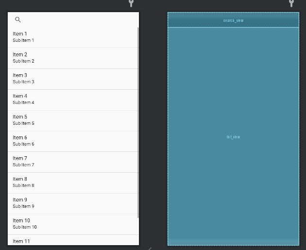

# NotePad

实现了时间戳和搜索(标题、内容)两个基本功能，以及更改记事本的背景色和记事本按照创建时间、修改时间和颜色进行排序的扩展功能。

## 一、结构

**类：**

>+ NotesList ：应用程序的入口，笔记本的首页面会显示笔记的列表。
>+ NoteEditor : 编辑笔记内容的Activity。
>+ TitleEditor : 编辑笔记标题的Activity。
>+ NotePadProvider: 这是笔记本应用的ContentProvider。
>+ Notecolor : 选择颜色
>+ NoteSearch : 实现搜索功能
>+ MyCursorAdapter : 自定义适配器，继承SimpleCursorAdapter

**布局：**

>+ note_editor.xml : 笔记主页面布局。
>+ notelist_item.xml : 笔记主页每个列表布局，包含笔记title和时间戳
>+ note_search.xml ：笔记搜索布局
>+ title_editor.xml : 修改笔记主题布局
>+ note_color.xml : 颜色选择界面布局。

**菜单：**

>+ editor_option_menu.xml ：编辑笔记内容菜单布局
>+ list_context_menu.xml : 编辑笔记内容上下文菜单布局
>+ list_option_menu.xml : 主页面菜单布局

## 二、基本功能

### (一)时间戳

布局文件：
**1.notelist_item.xml添加一个TextView组件，用于存放时间**

```

 <TextView
        android:id="@+id/text2"
        android:layout_width="match_parent"
        android:layout_height="match_parent"
        android:textAppearance="?android:attr/textAppearanceLarge"
        android:textSize="15dp"
        android:gravity="center_vertical"
        android:paddingLeft="10dip"
        android:singleLine="true"
        android:layout_weight="1"
        android:layout_margin="0dp"/>
```

界面布局：


**2.修改NoteList.java中的PROJECTION,添加NotePad.Notes.COLUMN_NAME_MODIFICATION_DATE字段，在后面的搜索才能读取到修改的时间**：

```

    private static final String[] PROJECTION = new String[] {
        NotePad.Notes._ID, // 0
        NotePad.Notes.COLUMN_NAME_TITLE, // 1
        NotePad.Notes.COLUMN_NAME_MODIFICATION_DATE,
        NotePad.Notes.COLUMN_NAME_BACK_COLOR
    };

```

**3.修改适配器内容，对NoteList.java中onCreate方法里的dataColumns，viewIDs进行修改，dataColumns的内容要装配到ListView中，新增一个文本框存放时间**：

```
    String[] dataColumns = { NotePad.Notes.COLUMN_NAME_TITLE,NotePad.Notes.COLUMN_NAME_MODIFICATION_DATE } ;
    int[] viewIDs = { R.id.text1 ,R.id.text2};
```

**4.修改NoteEditor.java中updateNote中的时间类型**：

```

    Date date=new Date(now);
    SimpleDateFormat simpleDateFormat=new SimpleDateFormat("yy-mm-dd HH:mm:ss");
    String dateFormat=simpleDateFormat.format(date);
    values.put(NotePad.Notes.COLUMN_NAME_MODIFICATION_DATE,dateFormat);

```

**效果图**：


### (二)搜索功能(标题、内容)

界面布局：
**1.在主界面布局添加搜索组件，list_options_menu.xml添加搜索功能**

```
    <item android:id="@+id/menu_search"
          android:title="@string/menu_search"
          android:icon="@android:drawable/ic_menu_search"
          android:showAsAction="always"/>
```


**2.新建一个搜索的布局文件note_search.xml**

```
    <?xml version="1.0" encoding="utf-8"?>
<LinearLayout xmlns:android="http://schemas.android.com/apk/res/android"
    android:layout_width="match_parent"
    android:layout_height="match_parent"
    android:orientation="vertical">
    <SearchView
        android:id="@+id/search_view"
        android:layout_width="match_parent"
        android:layout_height="wrap_content"
        android:iconifiedByDefault="false"/>
    <ListView
        android:id="@+id/list_view"
        android:layout_width="match_parent"
        android:layout_height="wrap_content"/>
</LinearLayout>
```



**3.在Notelist.java中onOptionsItemSelected方法添加选中menu_search的处理**


```
    case R.id.menu_search:
        Intent intent=new Intent(this,NoteSearch.class);
        this.startActivity(intent);
        return true;
```


**4.新建Notesearch.java实现搜索功能**

```
public class NoteSearch extends Activity implements SearchView.OnQueryTextListener{
    ListView listView;
    SQLiteDatabase sqLiteDatabase;

    private static final String[] PROJECTION=new String[]{
        NotePad.Notes._ID,
        NotePad.Notes.COLUMN_NAME_TITLE,
        NotePad.Notes.COLUMN_NAME_MODIFICATION_DATE
    };

    @Override
    protected void onCreate(Bundle savedInstanceState) {
        super.onCreate(savedInstanceState);
        setContentView(R.layout.note_search);
        SearchView searchView=findViewById(R.id.search_view);
        Intent intent=getIntent();
        if(intent.getData()==null){
            intent.setData(NotePad.Notes.CONTENT_URI);
        }
        listView=findViewById(R.id.list_view);
        sqLiteDatabase=new  NotePadProvider.DatabaseHelper(this).getReadableDatabase();
        searchView.setSubmitButtonEnabled(true);

        searchView.setQueryHint("search");
        searchView.setOnQueryTextListener(this);
    }

    @Override
    public boolean onQueryTextSubmit(String s) {
        Toast.makeText(this,"you shoose"+s,Toast.LENGTH_LONG).show();
        return false;
    }

    @Override
    public boolean onQueryTextChange(String s) {
        String selection1=NotePad.Notes.COLUMN_NAME_TITLE+" like ? or "+NotePad.Notes.COLUMN_NAME_NOTE+" like ?";
        String [] selection2={"%"+s+"%","%"+s+"%"};
        Cursor cursor=sqLiteDatabase.query(
                NotePad.Notes.TABLE_NAME,
                PROJECTION,
                selection1,
                selection2,
                null,
                null,
                NotePad.Notes.DEFAULT_SORT_ORDER
        );

        String []dataColumns = {
                NotePad.Notes.COLUMN_NAME_TITLE,
                NotePad.Notes.COLUMN_NAME_MODIFICATION_DATE
        };

        int [] viewIDS={
                R.id.text1,
                R.id.text2

        };
        SimpleCursorAdapter adapter=new SimpleCursorAdapter(
                this,
                R.layout.noteslist_item,
                cursor,
                dataColumns,
                viewIDS
        );

        listView.setAdapter(adapter);
        return true;
    }
}

```

**效果图：**

按照标题搜索：


按照内容搜索：

 


## 三、拓展功能

### (一)背景色

**1.更换主题，在AndroidManifest.xml的Notelist的Activity中添加，使其主题变为白色**：

```
android:theme="@android:style/Theme.Holo.Light"
```

**2.在NotePad.java中定义添加**

```
public static final String COLUMN_NAME_BACK_COLOR= "color";
```

**3.在NotePadProvider.java创建数据库的地方新增颜色字段(注意空格)，用于后续背景色的使用**：

```
@Override
public void onCreate(SQLiteDatabase db) {
    db.execSQL("CREATE TABLE " + NotePad.Notes.TABLE_NAME + " ("
        + NotePad.Notes._ID + " INTEGER PRIMARY KEY,"
        + NotePad.Notes.COLUMN_NAME_TITLE + " TEXT,"
        + NotePad.Notes.COLUMN_NAME_NOTE + " TEXT,"
        + NotePad.Notes.COLUMN_NAME_CREATE_DATE + " INTEGER,"
        + NotePad.Notes.COLUMN_NAME_MODIFICATION_DATE + " INTEGER,"
        + NotePad.Notes.COLUMN_NAME_BACK_COLOR + " INTEGER"
        + ");");
    }
```

**4.在NotePad.java中对记事本背景颜色进行定义**：

```
 public static final int DEFAULT_COLOR =0;
        public static final int GREY_COLOR= 1;
        public static final int YELLOW_COLOR = 2;
        public static final int GREEN_COLOR= 3;
        public static final int RED_COLOR = 4;
        public static final int teal_200_COLOR = 5;
        public static final int teal_700_COLOR= 6;
```

**5.在NotePadProvider.java添加相应处理**：
static中：
```
 sNotesProjectionMap.put(
        NotePad.Notes.COLUMN_NAME_BACK_COLOR,
        NotePad.Notes.COLUMN_NAME_BACK_COLOR
    );
```

insert方法中：
```
 if (values.containsKey(NotePad.Notes.COLUMN_NAME_BACK_COLOR) == false){
        values.put(NotePad.Notes.COLUMN_NAME_BACK_COLOR, NotePad.Notes.DEFAULT_COLOR);
    }
```

**6.自定义适配器，MyCursorAdapter.java继承SimpleCursorAdapter，将记事本所可以选择的颜色全部填充到ListView中**：

```
public class MyCursorAdapter extends SimpleCursorAdapter {

    public MyCursorAdapter(Context context, int layout, Cursor c, String[] from, int[] to) {
        super(context, layout, c, from, to);
    }

    @Override
    public void bindView(View view, Context context, Cursor cursor) {
        super.bindView(view, context, cursor);

    @SuppressLint("Range") int x=cursor.getInt(cursor.getColumnIndex(NotePad.Notes.COLUMN_NAME_BACK_COLOR));
        switch (x) {
            case NotePad.Notes.DEFAULT_COLOR:
                view.setBackgroundColor(Color.rgb(255, 255, 255));
                break;
            case NotePad.Notes.GREY_COLOR:
                view.setBackgroundColor(Color.rgb(186, 186, 182));
                break;
            case NotePad.Notes.YELLOW_COLOR:
                view.setBackgroundColor(Color.rgb(255, 235, 59));
                break;
            case NotePad.Notes.RED_COLOR:
                view.setBackgroundColor(Color.rgb(234, 43, 29));
                break;
            case NotePad.Notes.GREEN_COLOR:
                view.setBackgroundColor(Color.rgb(76, 175, 80));
                break;
            case NotePad.Notes.teal_200_COLOR:
                view.setBackgroundColor(Color.rgb(3, 218, 197));
                break;
            case NotePad.Notes.teal_700_COLOR:
                view.setBackgroundColor(Color.rgb(1, 135, 134));
                break;
            default:
                view.setBackgroundColor(Color.rgb(255, 255, 255));
                break;

        }

    }
}

```

**7.NotesList.java中PROJECTION添加颜色项**：

```
private static final String[] PROJECTION = new String[] {
        NotePad.Notes._ID, // 0
        NotePad.Notes.COLUMN_NAME_TITLE, // 1
        NotePad.Notes.COLUMN_NAME_MODIFICATION_DATE,
        NotePad.Notes.COLUMN_NAME_BACK_COLOR
    };
```

**8.将NoteList.java中的SimpleCursorAdapter改为MyCursorAdapter**：

```
MyCursorAdapter adapter= new MyCursorAdapter(
        this,                             // The Context for the ListView
        R.layout.noteslist_item,          // Points to the XML for a list item
        cursor,                           // The cursor to get items from
        dataColumns,
        viewIDs
    );
```
**效果图：**

原版：


新版：


**9.在editor_options_menu.xml添加一个更改背景颜色的选项**：

```
<item android:id="@+id/menu_color"
        android:title="@string/menu_color"
        android:icon="@drawable/ic_menu_edit"
        android:showAsAction='always'
    />
```

**10.在NoteEditor.java中onOptionsItemSelected方法添加对选中menu_color的处理**：

```
 case R.id.menu_color:
        changeColor();
        break;
```


**11.在NoteEditor.java中添加函数changeColor**：

```
    private final void changeColor(){
        Intent intent=new Intent(null,mUri);
        intent.setClass(NoteEditor.this, NoteColor.class);
        NoteEditor.this.startActivity(intent);
    }
```

**12.新建note_color.xml对选择背景颜色界面进行布局**：

```
<?xml version="1.0" encoding="utf-8"?>
<LinearLayout xmlns:android="http://schemas.android.com/apk/res/android"
    android:layout_width="match_parent"
    android:layout_height="match_parent"
    android:orientation="horizontal">

    <ImageButton
        android:id="@+id/white"
        android:layout_width="0dp"
        android:layout_height="50dp"
        android:background="@color/white"
        android:layout_weight="1"
        android:onClick="white"
        />
        ......
</LinearLayout>       
```


**13.创建NoteColor.java选择颜色**：

```
public class NoteColor extends Activity {

    private Cursor mCursor;
    private Uri mUri;
    private  int color;
    private  static final int COLUMN_INDEX_TITLE=1;
    private  static final  String[] PROJECTION=new String[]{
        NotePad.Notes._ID,
        NotePad.Notes.COLUMN_NAME_BACK_COLOR,
    };

    @Override
    protected void onCreate(Bundle savedInstanceState) {
        super.onCreate(savedInstanceState);
        setContentView(R.layout.note_color);

        mUri = getIntent().getData();
        mCursor = managedQuery(
                mUri,
                PROJECTION,
                null,
                null,
                null
        );
    }

    @Override
    protected void onResume() {
        if (mCursor != null){
            mCursor.moveToFirst();
            color=mCursor.getInt(COLUMN_INDEX_TITLE);
        }
        super.onResume();
    }

    @Override
    protected void onPause() {
        super.onPause();
        ContentValues values=new ContentValues();
        values.put(NotePad.Notes.COLUMN_NAME_BACK_COLOR, color);
        getContentResolver().update(mUri, values,null,null);
    }

    public void white(View view){
        color = NotePad.Notes.DEFAULT_COLOR;
        finish();
    }

    public void grey(View view){
        color = NotePad.Notes.GREY_COLOR;
        finish();
    }

    public  void red(View view){
        color = NotePad.Notes.RED_COLOR;
        finish();
    }


    public void yellow(View V){
        color = NotePad.Notes.YELLOW_COLOR;
        finish();
    }

    public void green(View view){
        color = NotePad.Notes.GREEN_COLOR;
        finish();
    }

    public void teal_200(View view){
        color = NotePad.Notes.teal_200_COLOR;
        finish();
    }

    public void teal_700(View view){
        color = NotePad.Notes.teal_700_COLOR;
        finish();
    }
}
```

**效果图：**

 


### (二)排序(创建时间、修改时间、颜色)

**1.在主界面布局添加搜索组件，在list_options_menu.xml添加排序功能，其中排序功能包括按创建时间、修改时间、颜色排序**

```
 <item
        android:id="@+id/menu_sort"
        android:title="@string/menu_sort"
        android:icon="@android:drawable/ic_menu_sort_by_size"
        android:showAsAction="always">
        <menu>
            <item android:id="@+id/menu_sort_createtime"
                android:title="@string/menu_sort_create_time"/>

            <item android:id="@+id/menu_sort_updatetime"
                android:title="@string/menu_sort_update_time"/>

            <item android:id="@+id/menu_sort_color"
                android:title="@string/menu_sort_color"/>

        </menu>
    </item>
```


**2.在Notelist中添加**：

```
    private Cursor cursor;
    private MyCursorAdapter myCursorAdapter;
    private String []dataColumns={ NotePad.Notes.COLUMN_NAME_TITLE , NotePad.Notes.COLUMN_NAME_MODIFICATION_DATE};
    private int[] viewIDs={R.id.text1 , R.id.text2};

```
**3.在Notelist中设置排序**：

按照创建时间排序

```

    case R.id.menu_sort_createtime:
        cursor=managedQuery(
            getIntent().getData(),
            PROJECTION,
            null,
            null,
            NotePad.Notes._ID
        );
        myCursorAdapter=new MyCursorAdapter(
            this,
            R.layout.noteslist_item,
            cursor,
            dataColumns,
            viewIDs
        );           
        setListAdapter(myCursorAdapter);
        return true;
```

**效果图：**


 按修改时间排序：

```
    case R.id.menu_sort_updatetime:
        cursor=managedQuery(
            getIntent().getData(),
            PROJECTION,
            null,
            null,
            NotePad.Notes.DEFAULT_SORT_ORDER
        );
        myCursorAdapter=new MyCursorAdapter(
            this,
            R.layout.noteslist_item,
            cursor,
            dataColumns,
             viewIDs
        );
        setListAdapter(myCursorAdapter);
        return true;
```

**效果图：**

按照修改时间排序：


按照颜色排序：
```
    case R.id.menu_sort_color:
        cursor=managedQuery(
            getIntent().getData(),
            PROJECTION,
            null,
            null,
            NotePad.Notes.COLUMN_NAME_BACK_COLOR
        );
        myCursorAdapter=new MyCursorAdapter(
            this,
            R.layout.noteslist_item,
            cursor,
            dataColumns,
            viewIDs
        );
        setListAdapter(myCursorAdapter);
        return true;

```

**效果图：**

按照颜色排序：

