#Android界面组件实验
**主界面**
跳转到以下4个相应的界面
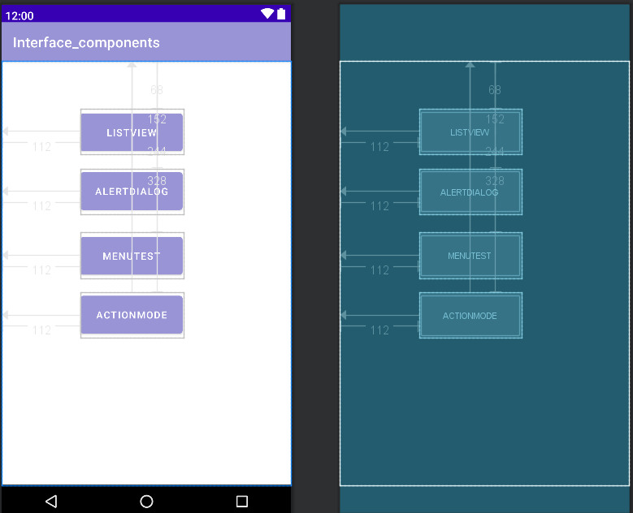
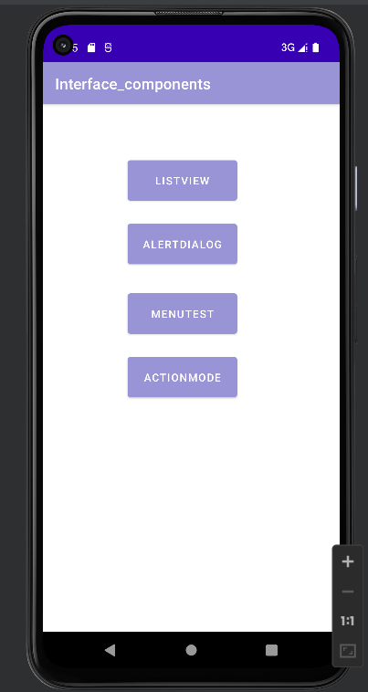
MainActivity.java
```
public class MainActivity extends AppCompatActivity {
    Button bt1;
    Button bt2;
    Button bt3;
    Button bt4;

    @Override
    protected void onCreate(Bundle savedInstanceState) {
        super.onCreate(savedInstanceState);
        setContentView(R.layout.activity_main);
        bt1 = (Button) findViewById(R.id.button);
        bt2 = (Button) findViewById(R.id.button2);
        bt3 = (Button) findViewById(R.id.button3);
        bt4 = (Button) findViewById(R.id.button4);

//      创建监听器
        bt1.setOnClickListener(listner);
        bt2.setOnClickListener(listner2);
        bt3.setOnClickListener(listner3);
        bt4.setOnClickListener(listner4);

    }

    Button.OnClickListener listner = new Button.OnClickListener() {
        public void onClick(View v) {
            Intent intent = new Intent(MainActivity.this, ListviewActivity.class);
            startActivity(intent);
        }
    };
    Button.OnClickListener listner2 = new Button.OnClickListener() {
        public void onClick(View v) {
            showDiglog();
        }
    };
    Button.OnClickListener listner3=new Button.OnClickListener(){
        public void onClick(View v){
            Intent intent=new Intent(MainActivity.this,MenuActivity.class);
            startActivity(intent);
        }
    };
    Button.OnClickListener listner4=new Button.OnClickListener(){
        public void onClick(View v) {
            Intent intent = new Intent(MainActivity.this,ActionModeActivity.class) ;
            startActivity(intent);
        }
    };

}
```

###1.Android ListView的用法
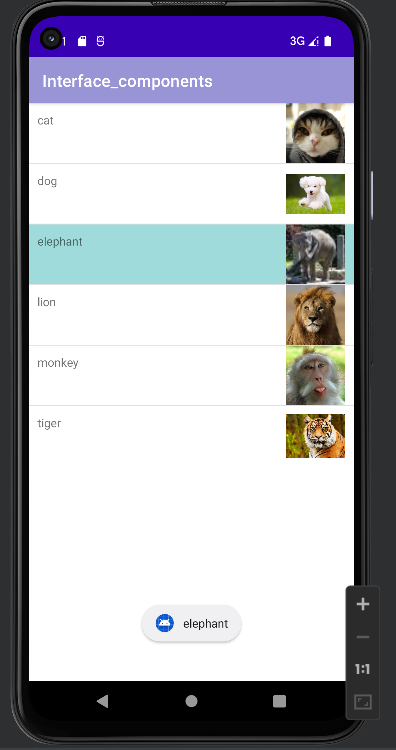

**1.1 利用SimpleAdapter实现，使用Toast显示选中的列表项信息。**
ListviewActivity.java
```public class ListviewActivity extends AppCompatActivity {

    @Override
    protected void onCreate(Bundle savedInstanceState) {
        super.onCreate(savedInstanceState);
        setContentView(R.layout.activity_listview);
        int []imageid=new int[]{R.drawable.cat,R.drawable.dog,R.drawable.elephant,
        R.drawable.lion,R.drawable.monkey,R.drawable.tiger};
        String[]title=new String[]{"cat","dog","elephant","lion","monkey","tiger"};
        List<Map<String,Object>> listitem=new ArrayList<Map<String,Object>>();
        for(int i=0;i<imageid.length;i++){
            Map<String,Object> map=new HashMap<String,Object>();
            map.put("image",imageid[i]);
            map.put("name",title[i]);
            listitem.add(map);
        }
        SimpleAdapter adapter=new SimpleAdapter(this,listitem,R.layout.listview_main,new String[]{"name","image"},
                new int[]{R.id.title,R.id.image});
        ListView listView=findViewById(R.id.listview);
        listView.setAdapter(adapter);
        listView.setOnItemClickListener(new AdapterView.OnItemClickListener() {
            @Override
            public void onItemClick(AdapterView<?> adapterView, View view, int i, long l) {
                Map<String,Object> map=(Map<String,Object>)adapterView.getItemAtPosition(i);

                Toast.makeText(ListviewActivity.this,map.get("name").toString(),Toast.LENGTH_LONG).show();
            }
        });
    }
}
```
###2.创建自定义布局的AlertDialog
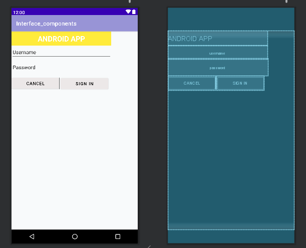
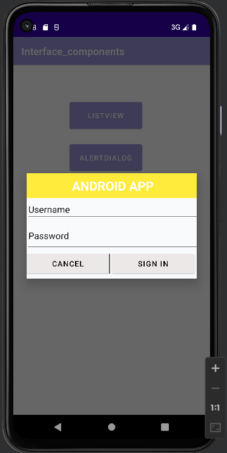
**2.1 alter_dialog.xml定义布局**
```
<?xml version="1.0" encoding="utf-8"?>
<LinearLayout xmlns:android="http://schemas.android.com/apk/res/android"
    xmlns:app="http://schemas.android.com/apk/res-auto"
    xmlns:tools="http://schemas.android.com/tools"
    android:layout_width="match_parent"
    android:layout_height="match_parent"
    android:background="#F8FAFB"
    android:orientation="vertical">

    <TextView
        android:layout_width="345dp"
        android:layout_height="50dp"
        android:background="@color/yellow"
        android:gravity="center"
        android:text="ANDROID APP"
        android:textAlignment="gravity"
        android:textColor="@color/white"
        android:textSize="25dp"
        android:textStyle="bold"></TextView>

    <EditText
        android:id="@+id/username"
        android:layout_width="344dp"
        android:layout_height="wrap_content"
        android:inputType="textPersonName"
        android:rotationX="2"
        android:text="Username" />

    <EditText
        android:id="@+id/password"
        android:layout_width="346dp"
        android:layout_height="60dp"
        android:inputType="textPersonName"
        android:rotationX="2"
        android:text="Password" />

    <Button
        android:layout_width="165dp"
        android:layout_height="50dp"
        android:text="Cancel"
        android:textSize="15dp"
        android:textColor="@color/black"
        android:backgroundTint="#ECE8E8"></Button>

    <View
        android:layout_width="2dip"
        android:layout_height="40dp"
        android:layout_marginLeft="165dp"
        android:layout_marginTop="-45dp"
        android:background="#686868">
    </View>

    <Button
        android:layout_width="165dp"
        android:layout_height="50dp"
        android:layout_marginLeft="170dp"
        android:layout_marginTop="-45dp"
        android:backgroundTint="#ECE8E8"
        android:text="Sign in"
        android:textColor="@color/black"
        android:textSize="15dp"></Button>

</LinearLayout>
```
**2.2 调用AlterDialog.Builder对象上的setView()将布局添加到AlterDialog.**
MainActivity.java
```
   public  void showDiglog(){
        AlertDialog.Builder builder=new AlertDialog.Builder(MainActivity.this);
        builder.setView(R.layout.alert_dialog);
        AlertDialog alertDialog=builder.create();
        alertDialog.show();
    }
```

###3.使用XML定义菜单
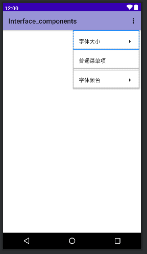  
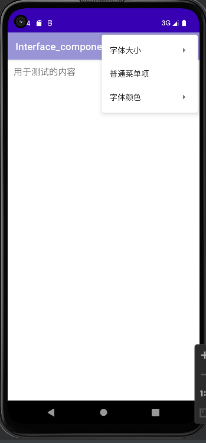 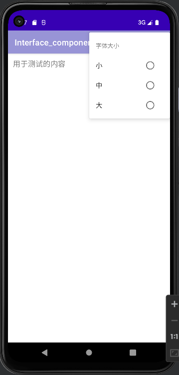  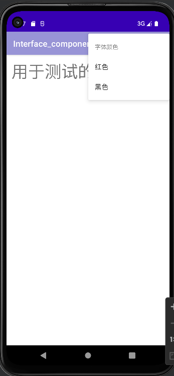 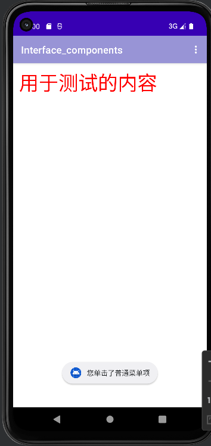
字体大小：点击之后设计测试文本的字体。
普通菜单项：点击之后弹出Toast提示。
字体颜色：点击之后设置测试文本的字体。

MenuActivity.java

```
public class MenuActivity extends AppCompatActivity {
    private TextView txt;
    @Override
    protected void onCreate(Bundle savedInstanceState) {
        super.onCreate(savedInstanceState);
        setContentView(R.layout.activity_menu);
        txt = findViewById(R.id.txt);
        // 为文本框注册上下文菜单
        registerForContextMenu(txt);
    }

    @Override
    public boolean onCreateOptionsMenu(Menu menu) {
//        填装R.menu.menu_main对应的菜单，并添加到menu
        getMenuInflater().inflate(R.menu.menu_main,menu);
        return super.onCreateOptionsMenu(menu);
    }
    //    菜单被单击后的回调方法
    @Override
    public boolean onOptionsItemSelected(@NonNull MenuItem item) {
        if (item.isCheckable()){
            item.setChecked(true);
        }
        // 判断单击的是哪个菜单项，并有针对性地做出响应
        switch (item.getItemId()){
            case R.id.font_小:txt.setTextSize(10*2);break;
            case R.id.font_中:txt.setTextSize(16*2);break;
            case R.id.font_大:txt.setTextSize(20*2);break;
            case R.id.red_font:txt.setTextColor(Color.RED);break;
            case R.id.black_font:txt.setTextColor(Color.BLACK);break;
            case R.id.plain_item:
                Toast.makeText(MenuActivity.this,"您单击了普通菜单项",Toast.LENGTH_SHORT).show();
                break;
        }
        return true;
    }
}
```

###4.创建上下文操作模式（ActionMode）的上下文菜单
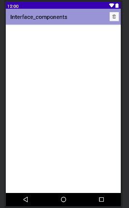
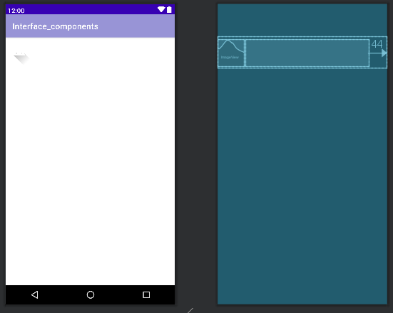
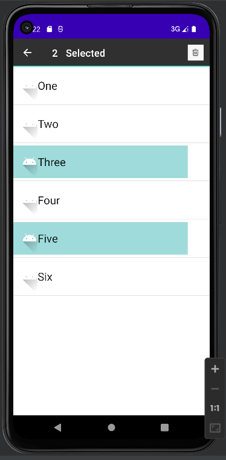
1.使用ListView创建List。
2.为List Item创建ActionMode形式的上下文菜单。

**4.1 activity_action_mode.xml定义主界面，只有一个ListView,将choiceMode设置为multipleChoiceModal，可以为多选。**
```
<?xml version="1.0" encoding="utf-8"?>
<androidx.constraintlayout.widget.ConstraintLayout xmlns:android="http://schemas.android.com/apk/res/android"
    xmlns:app="http://schemas.android.com/apk/res-auto"
    xmlns:tools="http://schemas.android.com/tools"
    android:layout_width="match_parent"
    android:layout_height="match_parent"
    tools:context=".ActionModeActivity">

    <LinearLayout android:layout_width="match_parent"
        android:layout_height="match_parent"
        android:orientation="vertical"
        tools:layout_editor_absoluteX="16dp"
        tools:layout_editor_absoluteY="0dp">

        <ListView
        android:id="@+id/list_view"
        android:layout_width="match_parent"
        android:layout_height="match_parent"
        android:choiceMode="multipleChoiceModal"/>

    </LinearLayout>


</androidx.constraintlayout.widget.ConstraintLayout>
```

**4.2 actionmode_row.xml,用于描述每一个ListView的选项**：

```
<?xml version="1.0" encoding="utf-8"?>
<RelativeLayout xmlns:android="http://schemas.android.com/apk/res/android"
    android:layout_width="match_parent"
    android:layout_height="wrap_content"
    android:paddingTop="5dp"
    android:paddingBottom="5dp">

    <ImageView
        android:id="@+id/img"
        android:layout_width="65dp"
        android:layout_height="65dp"
        android:src="@drawable/ic_launcher_foreground"/>

    <TextView
        android:id="@+id/text_view"
        android:layout_width="300dp"
        android:layout_height="65dp"
        android:gravity="center_vertical"
        android:layout_alignParentEnd="true"
        android:layout_alignParentRight="true"
        android:layout_marginEnd="44dp"
        android:layout_marginRight="44dp"
        android:textAppearance="?android:textAppearanceLarge" />


</RelativeLayout>

```

**4.3 编写Item类，每个选项对应的类，bo记录是否被选中，初始化为false**：
Item.java
```
public class Item {
    private String name;//显示的选项名
    private boolean bo;//记录是否被选中
//    构造函数
    public Item()
    {
        super();
    }
//    带两个参数的构造函数
    public Item(String name,boolean bo){
        super();
        this.name=name;
        this.bo=bo;
    }
//    set、get、toString方法
    public String getName(){
        return name;
    }
    public void setName(String name){
        this.name=name;
    }
    public boolean isBo(){
        return bo;
    }
    public void setBo(boolean bo){
        this.bo=bo;
    }

    @Override
    public String toString(){
        return "Item{"+"name='"+name+'\''+"bo="+bo+"}";
    }
}
```

**4.4 自定义适配器AdapterCur，继承 BaseAdapter**
AdapterCur.java
```
public class AdapterCur extends BaseAdapter {
    List<Item> list;  //item的list对象
    Context context;  //上下文对象
//初始化
    public AdapterCur(List<Item> list,Context context){
        this.list=list;
        this.context=context;
//        列表同步方法
        notifyDataSetChanged();
    }
//    得到当前列表的选项数量
    public  int getCount(){
        return list.size();
    }
//    根据下标得到列表项
    public Item getItem(int position){
        return list.get(position);
    }
    public long getItemId(int position){
        return 0;
    }

    public View getView(final int position,View convertView,ViewGroup parent) {
        final ViewHolder viewHolder;
//        如果还没加载
        if (convertView == null) {
//            加载布局文件，并将各个选项以及每个选项中的内容一一对应
            convertView = View.inflate(context, R.layout.actionmode_row, null);
            viewHolder = new ViewHolder();
            viewHolder.imageView = (ImageView) convertView.findViewById(R.id.img);
            viewHolder.textView = (TextView) convertView.findViewById(R.id.text_view);
            convertView.setTag(viewHolder);
        } else {
            viewHolder = (ViewHolder) convertView.getTag();
        }
//        得到十六进制的颜色的int值
        int lightblue = Color.parseColor("#9FDBDB");
        int white = Color.parseColor("#FFFFFF");
        viewHolder.textView.setText(list.get(position).getName());
//        如果被选中,改变颜色
        if (list.get(position).isBo() == true) {
            viewHolder.textView.setBackgroundColor(lightblue);
            viewHolder.imageView.setBackgroundColor(lightblue);
        }else {
            viewHolder.textView.setBackgroundColor(white);
            viewHolder.imageView.setBackgroundColor(white);
        }
        return convertView;

    }
    //创建一个内部类，定义每一个列表项所包含的东西
    class ViewHolder{
        ImageView imageView;
        TextView textView;
    }
}

```
**4.5 加载布局文件，定义相应变量，数据进行填充，为ListView设置适配器并设置监听，对actionMode菜单的每个按钮设置各自对应的点击事件**
ActionModeActivity.java
```
public class ActionModeActivity extends AppCompatActivity {
    private  ListView listView;
    private List<Item> list;
    private BaseAdapter adapter;
    private String[] name={"One","Two","Three","Four","Five","Six"};

    @Override
    protected void onCreate(Bundle savedInstanceState) {
        super.onCreate(savedInstanceState);
        setContentView(R.layout.activity_action_mode);

        listView=findViewById(R.id.list_view);
        list=new ArrayList<Item>();
//        定义Item并加入到list
        for (int i=0;i<6;i++){
            list.add(new Item(name[i],false));
        }
//        对listView进行适配器适配
        adapter=new AdapterCur(list,ActionModeActivity.this);
        listView.setAdapter(adapter);

//        设置listView允许多选模式
        listView.setChoiceMode(ListView.CHOICE_MODE_MULTIPLE_MODAL);
        listView.setMultiChoiceModeListener(new MultiChoiceModeListener() {
//            选中的数量
            int num=0;
//参数ActionMode长按后出现的标题栏,position当前选中的item序号,id是当前选中的item的id,checked如果是选中事件则为true,取消事件则为false
            @Override
            public void onItemCheckedStateChanged(ActionMode actionMode, int position, long id, boolean checked) {
//                调整选定条目
                if(checked==true){
                    list.get(position).setBo(true);
//                    实时刷新
                    adapter.notifyDataSetChanged();
                    num++;
                }else {
                    list.get(position).setBo(false);
//                    实时刷新
                    adapter.notifyDataSetChanged();
                    num--;
                }
//                用Textview显示
                actionMode.setTitle(" "+num+"   "+"Selected");
            }

//       ActionMode 长按出现的标题栏,Menu标题栏的菜单内容


            @Override
            public boolean onCreateActionMode(ActionMode actionMode, Menu menu) {
//                设置长安后所要显示的标题栏的内容
                MenuInflater inflater=actionMode.getMenuInflater();
                inflater.inflate(R.menu.actionmode_show,menu);
                num=0;
                adapter.notifyDataSetChanged();
                return true;
            }

            /*
             * 可在此方法中进行标题栏UI的创建和更新
             */
            @Override
            public boolean onPrepareActionMode(ActionMode actionMode, Menu menu) {
                adapter.notifyDataSetChanged();
                return false;
            }

            public void refresh(){
                for (int i=0;i<6;i++){
                    list.get(i).setBo(false);
                }
            }

            /*
             * 可在此方法中监听标题栏Menu的监听，从而进行相应操作
             * 设置actionMode菜单每个按钮的点击事件
             */
            @Override
            public boolean onActionItemClicked(ActionMode actionMode, MenuItem menuItem) {
               switch (menuItem.getItemId()){
//                       删除
                   case R.id.menu_delete:
                       num=0;
                       refresh();
                       adapter.notifyDataSetChanged();
//                       菜单按钮都设置返l
                       actionMode.finish();
                       return true;
                   default:
                       refresh();
                       adapter.notifyDataSetChanged();
                       num=0;
                       return false;

               }

            }

            @Override
            public void onDestroyActionMode(ActionMode actionMode) {
                refresh();
                adapter.notifyDataSetChanged();
            }
        });
    }
}
```
